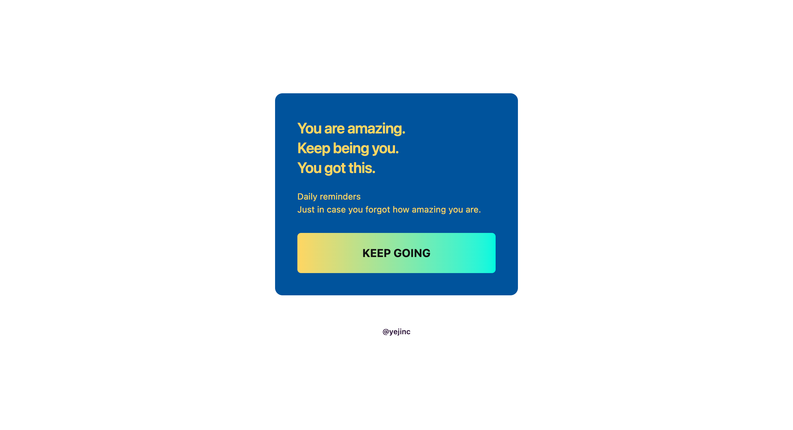
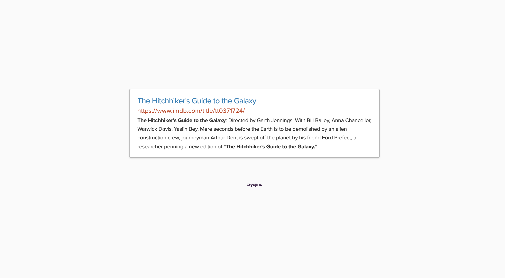
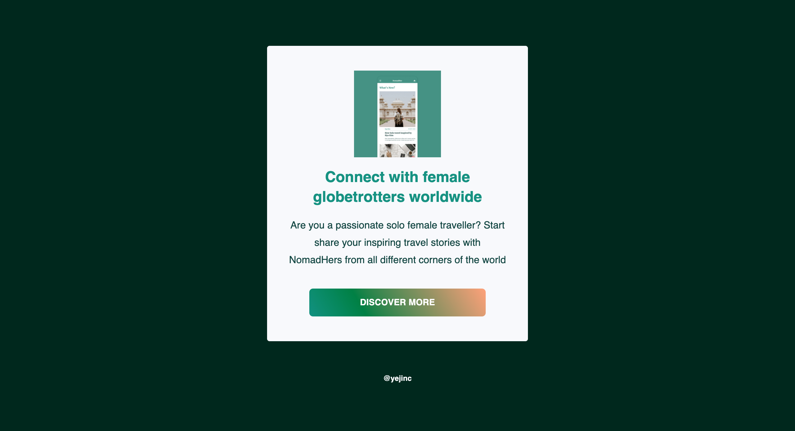
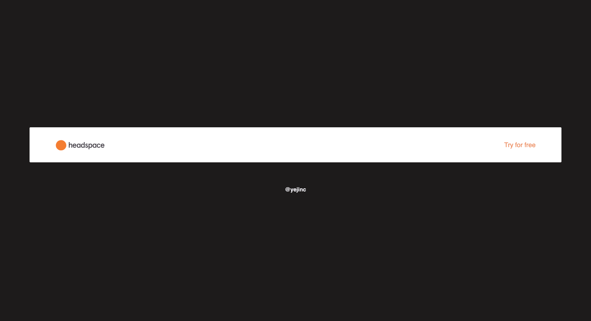
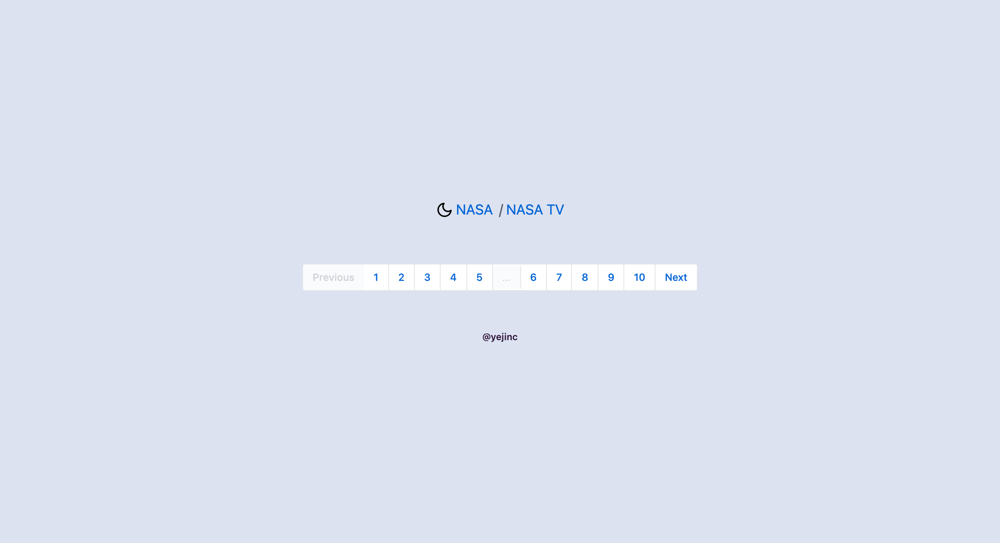
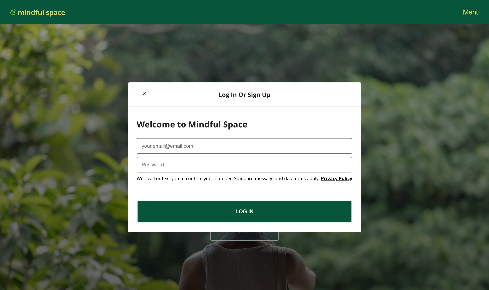
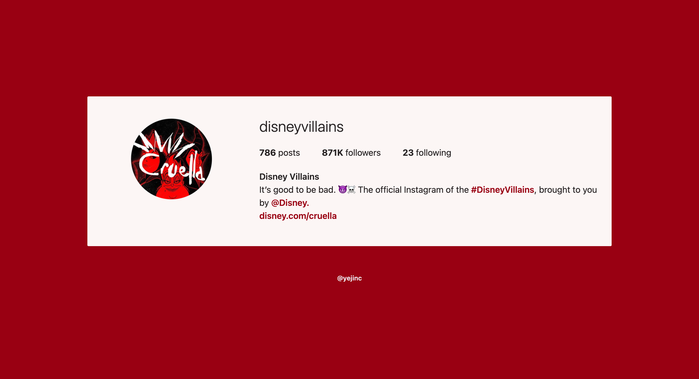
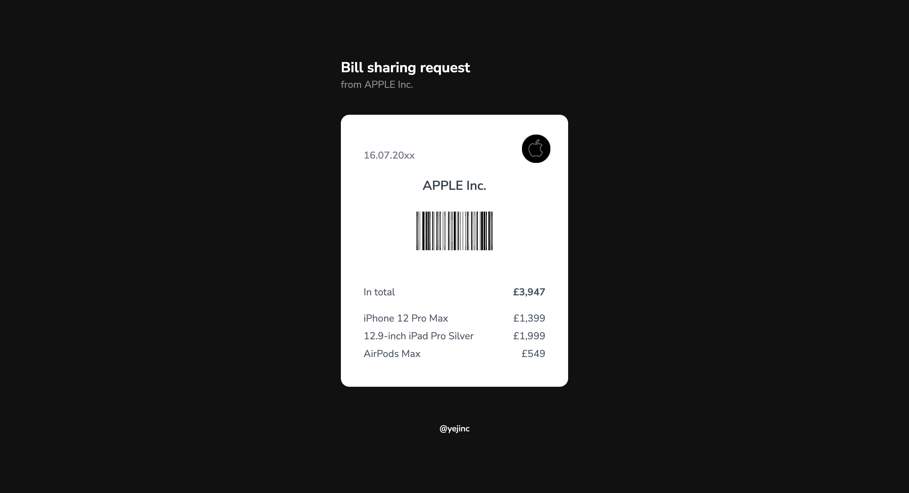

 
 

<!-- Header -->

  

<h1 align="middle">Archived Components</h2>

Creating and archiving components in progress

    
  
  
  
    
  

<!-- 
<a href="#">👉 Project link</a>
 -->

 
 

<!-- Content -->

## 📸 screenshots

 

### 01. Banner card

 
 

### 02. Search result

 
 

### 03. Feature box

 
 

### 04. Simple navbar

 
 

### 05. Breadcrumb pagination

 
 

### 🚧 06. Login modal

 
 

 
 

### 07. Responsive hero with banner

 
 

### 08. Instagram user profile

 
 

### 09. Receipt

 
 

### 10. Input

 
 
