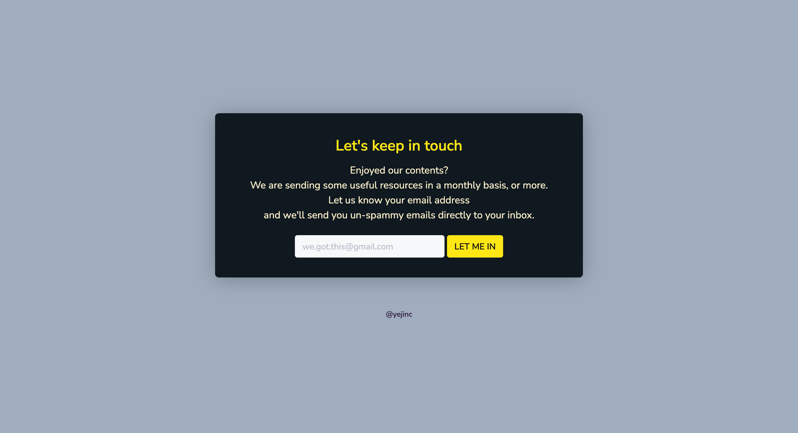

 
 

<!-- Header -->

  

<h1 align="middle">Archived Components</h2>

Creating and archiving components in progress

    
  
  
  
    
  

<!-- 
<a href="#">👉 Project link</a>
 -->

 
 

<!-- Content -->

## 📸 screenshots

 

| NAME                                 | THUMBNAIL                                                                                                            | STACKS                                                                                                                                                                                                                                                                                                                          | LINKS                                                                                                                                                                                                       |
| ------------------------------------ | -------------------------------------------------------------------------------------------------------------------- | ------------------------------------------------------------------------------------------------------------------------------------------------------------------------------------------------------------------------------------------------------------------------------------------------------------------------------- | ----------------------------------------------------------------------------------------------------------------------------------------------------------------------------------------------------------- |
| 01. Banner card                      |                                  |                                                                                                                          | <a href="https://yejinc.github.io/archived-components/01-banner-card/">Demo</a> / <a href='https://github.com/yejinc/archived-components/tree/main/01-banner-card'>Repo</a>                                 |
| 02. Search result                    |                              |                                                                                                                          | <a href="https://yejinc.github.io/archived-components/02-search-result/">Demo</a> / <a href='https://github.com/yejinc/archived-components/tree/main/02-search-result/02-search-result'>Repo</a>            |
| 03. Feature box                      |                                  |                                                                                                                          | <a href="https://yejinc.github.io/archived-components/03-feature-box/">Demo</a> / <a href='https://github.com/yejinc/archived-components/tree/main/03-feature-box'>Repo</a>                                 |
| 04. Simple navbar                    |                              |                                                                                                                          | <a href="https://yejinc.github.io/archived-components/04-simple-navbar/">Demo</a> / <a href='https://github.com/yejinc/archived-components/tree/main/04-simple-navbar'>Repo</a>                             |
| 05. Breadcrumb pagination            |              |                                                                                                                          | <a href="https://yejinc.github.io/archived-components/05-breadcrumb-pagination/">Demo</a> / <a href='https://github.com/yejinc/archived-components/tree/main/05-breadcrumb-pagination'>Repo</a>             |
| 🚧 06. Login modal                   |                                  |        | <a href="https://yejinc.github.io/archived-components/06-login-modal/">Demo</a> / <a href='https://github.com/yejinc/archived-components/tree/main/06-login-modal'>Repo</a>                                 |
| 07. Responsive hero  with banner |  |                                                                                                                          | <a href="https://yejinc.github.io/archived-components/07-responsive-hero-with-banner/">Demo</a> / <a href='https://github.com/yejinc/archived-components/tree/main/07-responsive-hero-with-banner'>Repo</a> |
| 08. Instagram user profile           |            |                                                                                                                          | <a href="https://yejinc.github.io/archived-components/08-instagram-user-profile/">Demo</a> / <a href='https://github.com/yejinc/archived-components/tree/main/08-instagram-user-profile'>Repo</a>           |
| 09. Receipt                          |                                          |                                                                                                                          | <a href="https://yejinc.github.io/archived-components/09-receipt/">Demo</a> / <a href='https://github.com/yejinc/archived-components/tree/main/09-receipt'>Repo</a>                                         |
| 10. Input                            |                                              |                                                                                                                          | <a href="https://yejinc.github.io/archived-components/10-input/">Demo</a> / <a href='https://github.com/yejinc/archived-components/tree/main/10-input'>Repo</a>                                             |
